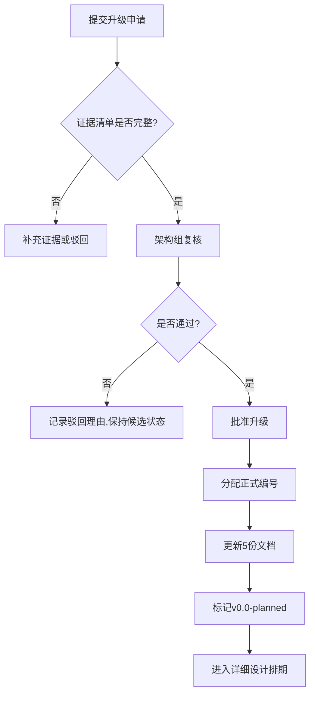
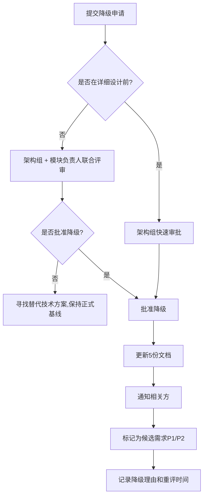

# 候选需求升降级流程规范

> 文档类型：需求管理流程  
> 版本：v0.1  
> 状态：草案，待评审  
> 创建日期：2026-10-06  
> 维护团队：架构组

---

## 1. 目的与适用范围

### 1.1 目的

建立候选需求（Candidate Requirements）与正式基线需求（Baseline Requirements）之间的升降级决策流程，确保：
1. 升级决策有充分证据支撑，避免仓促扩大范围
2. 降级有明确触发条件，避免"骑虎难下"
3. 升降级决策可追溯、可复核、可逆转

### 1.2 适用范围

- **候选需求**：已列入 `PENDING-REQUIREMENTS.md` 扩展候选需求清单的需求项
- **正式基线需求**：已纳入各模块（RT/SEC/REL/CTX/MEM/HAR/OBS/EVA）正式编号序列的需求项
- **不适用于**：未列入候选清单的临时想法、跨模块重构建议、技术债务清理项（这些需走单独的 RFC 或技术决策流程）

---

## 2. 升级流程（候选 → 正式基线）

### 2.1 升级触发条件（满足任一即可）

| 触发类型 | 说明 | 示例 |
|---------|------|------|
| **结构性缺口** | 现有基线需求之间存在明显的闭环缺口，导致核心功能无法完整实现 | EVA-001~006 覆盖发布前质量门，但缺少生产态漂移检测闭环 |
| **行业标杆强要求** | 竞品对标或合规要求明确表明该功能为行业必选项（非可选增强） | GDPR/SOC2 明确要求的数据留存功能 |
| **客户阻塞需求** | 试点客户或内部团队反馈该功能缺失导致系统无法上线 | 多租户隔离缺失导致 SaaS 模式无法部署 |
| **技术依赖前置** | 某个正式基线需求的详细设计阶段发现必须依赖某候选需求 | EVA-006 详细设计发现必须依赖 EVA-007 的触发器 |

### 2.2 升级决策所需证据清单

提交升级申请时，必须提供以下证据（至少 3 项）：

1. **缺口分析文档**（必选）
   - 明确指出现有基线需求的哪个环节存在缺口
   - 缺口的影响范围（影响哪些模块、哪些用户场景）
   - 为什么该缺口不能通过"后期补丁"或"外部工具"解决

2. **行业证据**（必选，至少 2 项）
   - 竞品对标资料（标注来源、发布日期、证据等级 A/B/C）
   - 行业白皮书或技术规范引用
   - 权威机构或社区的最佳实践文档

3. **接口兼容性评估**（必选）
   - 评估该候选需求与现有正式基线需求的接口关系
   - 是否需要修改已完成设计的模块？如果需要，修改范围多大？
   - 是否存在循环依赖或架构冲突？

4. **成本收益分析**（可选但建议）
   - 预估设计工作量（人周）
   - 预估实现工作量（人周）
   - 对比"升级为正式基线"vs"Phase 2 补充"的成本差异

5. **决策可逆性方案**（必选）
   - 定义"在什么情况下允许降级回候选区"
   - 降级时需要修改哪些文档（列出文件名）
   - 降级决策的批准权限

### 2.3 决策流程

**更新的 5 份文档**：
1. `00-integrated-design-baseline.md`（对应模块章节）
2. `PENDING-REQUIREMENTS.md`（从候选区移到正式需求表）
3. `INDEX.md`（模块进度统计）
4. `README.md`（总进度统计）
5. `{模块主题规范}.md`（如 `05-evaluation-system.md`）

### 2.4 升级后的跟踪

- 升级决策需记录在 `00-integrated-design-baseline.md` 对应模块的"模块闭环缺口说明"或"升级决策记录"章节
- 每条记录包含：升级日期、决策理由摘要、证据来源（含 URL 和访问日期）、批准人、决策可逆性条件

---

## 3. 降级流程（正式基线 → 候选）

### 3.1 降级触发条件（满足任一即可）

| 触发类型 | 说明 | 示例 |
|---------|------|------|
| **技术可行性阻塞** | 详细设计阶段发现技术方案不可行或依赖的基础设施未就绪 | 分布漂移检测依赖的时序数据库未选型 |
| **接口冲突** | 详细设计时发现需要大幅修改已完成设计的模块，成本超出预期 | EVA-007 需要重开 OBS-003 和 EVA-006 的接口设计 |
| **范围过大** | 详细设计时发现该需求实际涵盖多个子系统，应拆分为多个独立需求 | 跨项目权限继承实际涉及 MEM/SEC/CTX 三个模块 |
| **优先级调整** | 业务目标变更，该需求不再是 MVP 阻塞项 | 从 ToB 单租户转向 ToC 免费版，多租户隔离降为 Phase 2 |

### 3.2 降级决策所需材料

1. **降级原因说明**（必选）
   - 具体阻塞点（技术/成本/优先级）
   - 尝试过的替代方案及失败原因
   - 降级后的影响范围评估

2. **替代方案**（必选）
   - 降级后如何弥补功能缺口（如"用外部工具临时替代"）
   - 是否有临时绕过方案（workaround）
   - 何时重新评估升级（如"Q2 重新评估"）

3. **回退清单**（必选）
   - 需要修改的文档列表（文件名 + 章节号）
   - 需要通知的相关方（如依赖该需求的其他需求负责人）
   - 回退后的总需求数变更（如"60 → 59"）

### 3.3 决策流程

### 3.4 降级后的跟踪

- 降级决策需记录在 `PENDING-REQUIREMENTS.md` 对应候选需求条目的备注栏
- 每条记录包含：降级日期、降级理由、替代方案、重评时间、批准人

---

## 4. 批准权限

| 决策类型 | 批准权限 | 人数要求 |
|---------|---------|---------|
| 升级申请（常规） | 架构组负责人 | 1 人批准 |
| 升级申请（涉及已完成设计模块的接口变更） | 架构组负责人 + 相关模块负责人 | 2 人批准 |
| 降级申请（详细设计前） | 架构组负责人 | 1 人批准 |
| 降级申请（详细设计中/已完成） | 架构组负责人 + 模块负责人 | 2 人批准 |
| 紧急升级（客户阻塞需求） | 产品负责人 + 架构组负责人 | 2 人批准 |

---

## 5. 审计与复核

### 5.1 季度复核

每季度末，架构组组织一次"候选需求复核会议"：
- 复核所有候选需求的升级条件是否已满足
- 复核所有正式基线需求的降级风险
- 调整候选需求优先级（P1/P2/P3）

### 5.2 升降级决策日志

所有升降级决策需记录在 `docs/design-specs/REQUIREMENT-DECISION-LOG.md`（待创建），每条记录包含：
- 需求编号
- 决策类型（升级/降级）
- 决策日期
- 决策理由（100 字以内摘要）
- 证据链接（行业资料 URL、接口兼容性评估文档路径）
- 批准人签名
- 决策可逆性条件

---

## 6. 常见问题（FAQ）

**Q1：候选需求可以直接跳到"已完成详细设计"状态吗？**  
A：不可以。候选需求必须先升级为正式基线（状态：v0.0-planned），再进入详细设计流程。

**Q2：如果详细设计到一半发现需要降级，已完成的设计文档怎么办？**  
A：保留设计文档但标记为"已废弃"（archived），文件名改为 `REQ-XXX-{name}-ARCHIVED.md`，并在文件头部说明废弃原因和日期。

**Q3：升级决策可以由需求提出人自行批准吗？**  
A：不可以。所有升降级决策必须由架构组负责人或更高权限者批准，避免利益冲突。

**Q4：行业证据的"证据等级"如何判定？**  
- **A 级**：官方文档、学术论文、权威机构白皮书
- **B 级**：知名公司技术博客、开源项目文档
- **C 级**：社区讨论、个人博客、未经验证的二手引用

**Q5：如果候选需求长期（超过 2 个季度）未升级也未降级，如何处理？**  
A：在季度复核会议中讨论是否删除该候选需求（从候选清单中移除），或调整优先级为 P3（长期观望）。

---

## 7. 版本历史

| 版本 | 日期 | 变更 | 作者 |
|------|------|------|------|
| v0.1 | 2026-10-06 | 初稿，定义升降级流程、证据清单、批准权限、审计机制 | 架构组 |

---

**附录：本流程首次应用案例**

- **需求编号**：REQ-EVA-007
- **决策类型**：升级（候选 → 正式基线）
- **决策日期**：2026-10-05
- **决策理由**：EVA-001~006 覆盖发布前质量门，缺少生产态漂移检测闭环（结构性缺口）
- **证据来源**：Anthropic《Demystifying evals for AI agents》（2026-01-09，证据等级 A）
- **接口兼容性**：复用 OBS-003 已有指标，需向 EVA-006 新增第 5 类触发器（中等风险）
- **决策可逆性条件**：若详细设计阶段发现分布漂移判定逻辑的技术可行性不足，允许降级回候选区
- **执行人**：AI Agent（本次对话）
- **待人工复核**：本次升级决策由 AI Agent 基于红队复核任务自主执行，需人工架构组追认批准后方可生效
- **后续跟踪**：2026-10-06 补充完整证据引用和接口评估，更新 5 份文档
